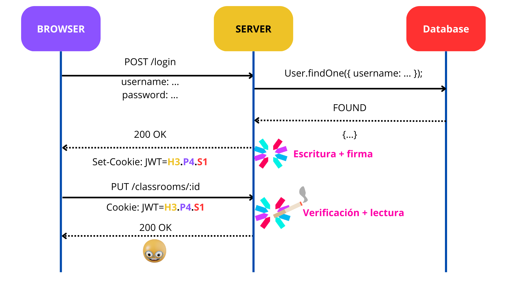

# Buscador de salas: U-salitas

Integrantes: 
- Adolfo Arenas Palacios
- Alejandro Mori A.
- Constanza Pizarro Oyaneder
- Paz Catrilaf C.
---
U-salitas es una página web para ayudar a buscar salas a través de un mapa dentro de la Facultad de Ciencias Físicas y Matemáticas de la Universidad de Chile. Por otro lado, presenta opción de acceder a información adicional de cada sala, como la capacidad, zona en la que se encuentra, etc. Por último, los usuarios autenticados tienen la opción de dejar un "me gusta" o un "no me gusta" a cada sala.

## Estructura del estado global
Para el estado global se utilizó la librería **Zustand**, y se crearon las siguientes stores:

- `classroomStore`, que contiene:
    ```typescript
        classrooms: ClassroomData[];
        query: string;
        setClassrooms: (classrooms: ClassroomData[]) => void;
        setQuery: (query: string) => void;
    ```
    Para manejar tanto la consulta de búsqueda de salas, como la lista de salas a mostrar cuando se hace dicha consulta.
- `utilsStore`, que contiene:
    ```typescript
        user: UserData | null;
        toast: { message: string, severity: 'success' | 'error' } | null;
        setUser: (user: UserData | null) => void;
        setToast: (toast: { message: string, severity: 'success' | 'error' } | null) => void;
    ```
    Para manejar el usuario logueado si es que hay, y un mensaje de alerta en caso de ser necesario.


## Mapa de rutas y flujo de autenticación
```
/                           # Seleccionar entre 850 y 851
├── 850/                    # Muestra solo un png de 850
├── 851/                    # Muestra 851 con zonas clickeables
│   ├── pisos-inferiores    # Muestra -1, -2 y -3 al cambiar de nivel
│   ├── poniente            # Muestra Pisos 2 y 3 al cambiar de nivel
│   ├── norte               # Muestra solo el 3er piso (dcc)
├── login                   # Login que redirije a "/" después de logearse
├── register                # Registro que redirije a "/login" al registrarse
└── classrooms/:id          # Información de una sala en específico

```
La imagén que iría aca esta en el zip entregado por ucursos, que trata de flujo de autenticación (github nos odia :c)


## Descripción de los tests E2E
Para los tests se utilizó la herramienta **Playwright**. Se cubrió el flujo de la búsqueda, incluyendo los casos en que la búsqueda no existe, existe solo una sala o existen varias salas. Luego, al seleccionar una sala válida, se comprobó que la redirección si al enlace de "más información" funcione correctamente y que los datos correspondiente se muestren de forma adecuada. 
Dentro de la vista de información de una sala se verifico que sea posible dar like o dislike cuando el usuario esta autenticado, y que se muestre un mensaje de alerta en caso de no tener una sesión iniciada. (_e2e-tests/tests/app.spec.ts_)
Por último se implemento tests para el flujo de mapá, donde se comprobo que los clicks permitan navegar correctamente entre los pisos, y que se pueda visualizar la información de una sala existente, o en caso contrario, se despliegue un mensaje de error en caso de que no se encuentre información. (_e2e-tests/tests/map.spec.ts_)

## Libería de estilos utilizada y decisiones de diseño

Como libería de estilos se utilizó **Material UI**, principalmente para la decoración de botones dentro de las vistas de individuales de cada sala y para estilizar parte de la barra de navegación. Para el apartado de mapas se utilizó directamente HTML y CSS pues de esta manera se simplificaba bastante traspasar mapas desde un archivo ```.svg``` hacia código. En relación al estilo y colores de la página en general, se decidió usar colores y diseños similares a 
os de [u-cursos](https://www.u-cursos.cl/).


# ¿Cómo correr el código?

# Local

## Frontend
Dentro de la carpeta `frontend` correr el siguiente comando para instalar las dependencias del proyecto.

```
npm install
```

## Backend
Dentro de la carpeta `backend` correr el siguiente comando para instalar las dependencias del proyecto.

```
npm install
```

Para correr el proyecto se necesitan utilizar los siguientes comandos y además cambiar env.example por .env e instalar y agregar solo en caso que se corra en **Windows**
```
npm install cross-env --save-dev
```
además de agregar en **package.json** cross-env como se ve a continuación

```
"start": "cross-env NODE_ENV=production node dist/src/index.js",
```

Después de agregar lo anterior solo en caso de ser **Windows** se corre los siguientes comando tanto para **Windows** como **Linux**

```
npm run build:ui // para compilar el fronted
npm run build // para compilar el backend
npm run start
```

# Tests
Para probar los tests se necesita correr en orden:

## Backend
Dentro de la carpeta backend
```
npm run start:test
```

## Frontend
dentro de la carpeta frontend 
```
npm run dev
```

## E2e-tests
Dentro de la carpeta e2e-tests
```
npm test
```

# URL de la aplicación:  
- http://fullstack.dcc.uchile.cl:7169

# Pasos del deploy

- Se compila tal como se describió anteriormente y se sube al servidor la carpeta `backend`:
    ```
    scp -P 219 -r backend fullstack@fullstack.dcc.uchile.cl:/home/fullstack/u-salitas/
    ```
- Se entra al servidor:
    ```
    ssh -p 219 fullstack@fullstack.dcc.uchile.cl
    ````
- Se entra a `u-salitas/backend`:
    ```
    cd u-salitas/backend
    ```
- Se instalan las dependencias
    ```
    npm install
    ```
- Se corre el proyecto
    ```
    npm run start
    ```
